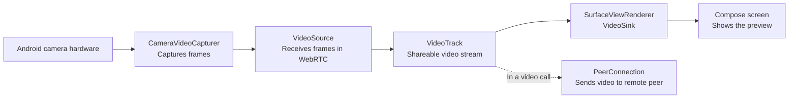

# WebRTC Camera Pipeline: Interview Cheat Sheet

## One-line explanation

The capturer reads frames from the phone camera, the source accepts them into
WebRTC, the track represents the usable video stream, and the renderer draws
that stream on the screen.

## The four terms

### `CameraVideoCapturer`

**Interview answer:** It is WebRTC's camera adapter. It opens the Android
camera, captures frames, and passes them into WebRTC.

**In this project:** `WebRtcManager` creates it from the available Camera2 or
Camera1 device.

### `VideoSource`

**Interview answer:** It is the WebRTC input pipeline for raw video frames.
The capturer sends frames to its `capturerObserver`.

**In this project:** One camera capturer feeds one `VideoSource`.

### `VideoTrack`

**Interview answer:** It is the shareable video stream created from a
`VideoSource`. We attach a track to a renderer for local preview or to a
`PeerConnection` when sending video to another user.

**In this project:** The track is created with ID `local_camera_track` and is
used for the local preview.

### `SurfaceViewRenderer`

**Interview answer:** It is a native Android `View` that acts as a WebRTC
`VideoSink`: it receives the track's frames and renders them with OpenGL.

**In this project:** Compose hosts it through `AndroidView` and attaches it by
calling `videoTrack.addSink(renderer)`.

## Frame flow

## How the project starts the flow

1. Camera permission is granted in `CameraPreviewScreen`.
2. `CameraPreviewViewModel.startCamera()` asks `WebRtcManager` to initialize
   WebRTC and start capture.
3. `WebRtcManager` builds `CameraVideoCapturer -> VideoSource -> VideoTrack`.
4. The running Compose UI creates a `SurfaceViewRenderer`.
5. The ViewModel attaches the renderer as a sink, so camera frames appear on
   screen.

## Useful interview follow-up

**Why do we need both `VideoSource` and `VideoTrack`?**

`VideoSource` owns the incoming frames. `VideoTrack` is the stream handle that
can be enabled, rendered locally, or sent through a `PeerConnection`. This
separation lets one source feed multiple consumers.

## Project references

- `WebRtcManager.kt`: creates and connects the capturer, source, and track.
- `CameraPreviewViewModel.kt`: attaches and detaches the renderer sink.
- `CameraPreviewScreen.kt`: creates the `SurfaceViewRenderer` inside Compose.
